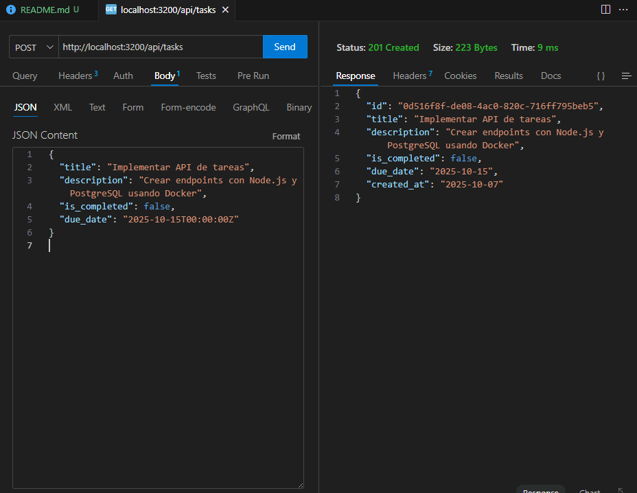

# 🧠 Prueba Técnica - American Capital

Este proyecto es una **API RESTful** desarrollada con **Node.js, Express y PostgreSQL**, diseñada para gestionar tareas (CRUD completo) y documentada con **Swagger**.  
Está totalmente **contenedorizada con Docker**, lo que facilita su despliegue y ejecución en cualquier entorno sin configuraciones complicadas.

---

## 📁 Descripción del proyecto

Esta API permite realizar operaciones CRUD sobre tareas, almacenándolas en una base de datos PostgreSQL.  
Cada tarea contiene:

- 🆔 `id`: Identificador único (UUID)
- 📝 `title`: Título de la tarea (obligatorio)
- 📄 `description`: Descripción detallada (opcional)
- ✅ `is_completed`: Estado de la tarea (por defecto `false`)
- 📅 `due_date`: Fecha límite de entrega (opcional)
- 📆 `created_at`: Fecha de creación (generada automáticamente)

Además, la API expone su **documentación interactiva con Swagger**, lo que permite explorar y probar todos los endpoints desde el navegador.

---

## 🛠️ Tecnologías utilizadas

- 🟢 **Node.js** – entorno de ejecución de JavaScript
- 🚀 **Express.js** – framework para construir APIs REST
- 🐘 **PostgreSQL** – base de datos relacional
- 🐳 **Docker & Docker Compose** – para la contenedorización y despliegue
- 📚 **Swagger UI & Swagger JSDoc** – documentación interactiva de la API
- 📅 **dayjs** – manejo y formateo de fechas
- 🔐 **dotenv** – gestión de variables de entorno

---

## 📦 Instalación y ejecución (con Docker)

Sigue estos pasos para levantar el proyecto en tu máquina 🧰:

### 1️⃣ Clonar el repositorio

bash
git clone https://github.com/juan1214s/prueba_tecnica_American_Capital.git
cd prueba_tecnica_American_Capital

### Crea el archivo .env

DB_USER=juan
DB_PASS=matas128
DB_HOST=db
DB_NAME=tasks_db
DB_PORT=5432
PORT=3200

---

### Construir y levantar los contenedores 🐳

Ejecuta el siguiente comando en la raíz del proyecto:

- docker-compose up --build

Esto hará que se levanten:

🐘 Un contenedor con PostgreSQL (tasks_db)

🚀 Un contenedor con la API (todo_api)

📌 La API estará disponible en:
👉 http://localhost:3200

---

## 📚 Documentación de la API (Swagger)

Una vez levantado el proyecto, puedes acceder a la documentación completa desde tu navegador en:

👉 http://localhost:3200/api-docs/#/

Desde ahí podrás:

Explorar todos los endpoints disponibles

Probar las solicitudes directamente desde el navegador

Ver la estructura de las respuestas y parámetros

--- 

## 📁 Estructura del proyecto

src/
├── app.js # Configuración principal de Express
├── index.js # Punto de entrada del servidor
├── controller/
│ └── taskController.js # Lógica de los endpoints
├── service/
│ └── taskService.js # Lógica de negocio y consultas SQL
├── db/
│ ├── dbconnection.js # Conexión a PostgreSQL
│ └── init.sql # Script inicial para la base de datos
├── routes/
│ └── taskRoutes.js # Definición de rutas
└── swagger.js # Configuración de Swagger

---

## Endpoints principales

| Método | Endpoint         | Descripción                    |
| ------ | ---------------- | ------------------------------ |
| GET    | `/api/tasks`     | Obtener todas las tareas       |
| GET    | `/api/tasks/:id` | Obtener una tarea por ID       |
| POST   | `/api/tasks`     | Crear una nueva tarea          |
| PUT    | `/api/tasks/:id` | Actualizar una tarea existente |
| DELETE | `/api/tasks/:id` | Eliminar una tarea             |

---

## 🧪 Ejemplo de JSON para crear tareas

```json
{
  "title": "Implementar API de tareas",
  "description": "Crear endpoints con Node.js y PostgreSQL usando Docker",
  "due_date": "2025-10-15T00:00:00Z"
}



## 📚 Vista previa de la documentación (Swagger)

<p align="center">
  
</p>


## ✨ Autor

👨‍💻 **Juan Manuel Sánchez Alzate**  
📍 Desarrollador Full Stack especializado en APIs con Node.js y Docker.  

📌 [Repositorio en GitHub](https://github.com/juan1214s/prueba_tecnica_American_Capital)

